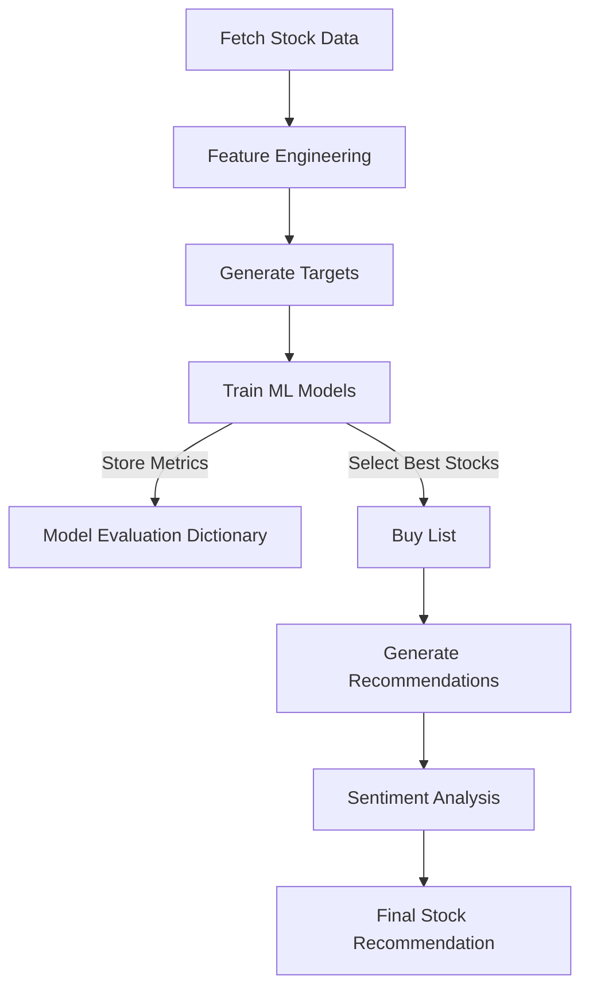

# Stock Market Prediction and Recommendation System

## 📌 Overview
This project implements a stock market prediction and recommendation system using machine learning and sentiment analysis. The notebook fetches stock data, processes it, trains predictive models, evaluates them, and generates stock recommendations. The model primarily focuses on **BankNifty** stocks.

## Google Colab Notebook-
https://colab.research.google.com/drive/1opjElTZgKaDMISfxPs--S3GdGD6vOEa-?usp=sharing

## ⚙️ Workflow
### 1️⃣ **Data Collection**
- Historical stock data is fetched using `yfinance`.
- Stocks from the **BankNifty index** are selected.
- Data is cleaned and structured for analysis.
- One can change the stock ticker list and can get the same outputs for different stock lists like S&P 500, Nifty, etc

### 2️⃣ **Feature Engineering**
- Technical indicators from the `ta` library are applied.
- Additional statistical and volume-based features are computed.
- Data is normalized and formatted for model training.

### 3️⃣ **Target Generation**
- A binary classification target is created.
- Stocks are labeled as **1** (buy signal) if price conditions are met within a future window.
- Otherwise, they are labeled as **0**.
- One can also generate a 'sell side' list by just commenting out the other target function in the notebook and commenting the buy side target code snippet

### 4️⃣ **Model Training & Evaluation**
- Multiple machine learning models are trained for each stock.
- Evaluation metrics are stored in `model_dict`.

### 5️⃣ **Stock Recommendations**
- The system filters stocks based on model performance and technical signals.
- A `buy_list` is generated.
- Final recommendations are made using sentiment analysis.

## 🔍 Detailed Explanation
### **1️⃣ Model Evaluation Dictionary (`model_dict`)**
`model_dict` stores evaluation results for each trained stock model such as classification reports, confusion matrix, ROC curve, cross validation scores for test data as well as simulated stress tests, etc

📌 **Sample Output:**  

### **2️⃣ Buy List (`buy_list`)**
The `buy_list` contains stocks that passed technical and model-based filters.

📌 **Sample Output:**  

### **3️⃣ Recommendations (`recommendations`)**
The recommendations list suggests the best stocks to invest in based on related stocks from the same sector(used Nifty 500 here) and with high correlation with the stocks in buy_list

📌 **Sample Output:**  

### **4️⃣ Sentiment Score & Analysis**
The sentiment score assesses market news and trends using crew ai, site scrapping, agentic ai.

📌 **Sample Output:**  

### **5️⃣ Final Stock Recommendation**
The final stock recommendation is based on model confidence and sentiment analysis.

📌 **Sample Output:**  

## 🔗 Technologies Used
- **Python** (Pandas, NumPy, scikit-learn, yfinance, ta, optuna)
- **Machine Learning** (XGBoost Classifier)
- **Sentiment Analysis** (crew ai, BeautifulSoup)
- **Finance & Quantitative Analysis** (correlation, target defining)

## 📈 Flowchart

## 🚀 How to Use
1. Clone the repository.
2. Run the Google Colab notebook.
3. Analyze the outputs and invest wisely!

---

### 📢 Disclaimer
This project is for educational purposes only. It does not constitute financial advice.
