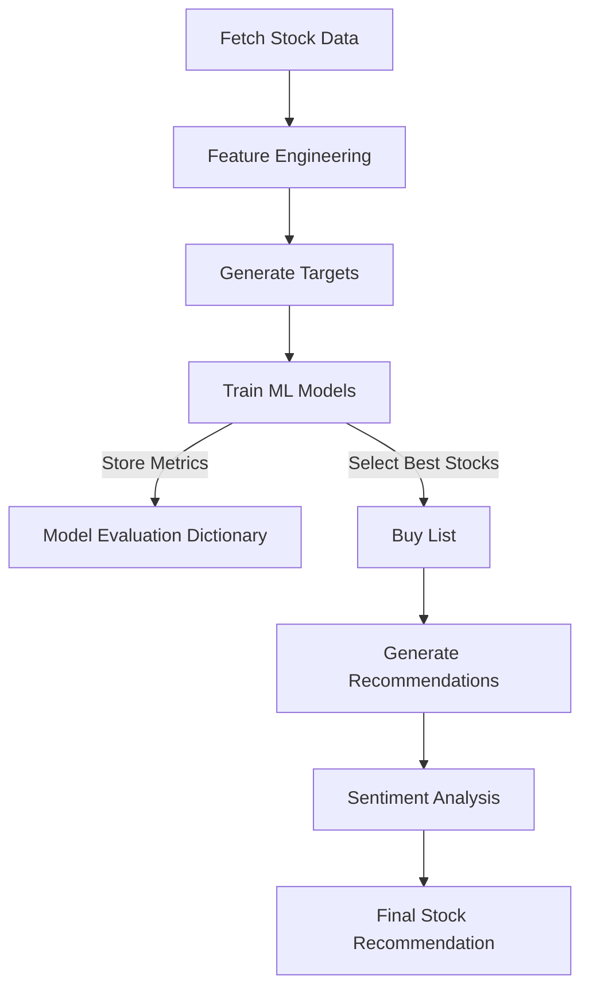

# Stock Market Prediction and Recommendation System

## 📌 Overview
This project implements a stock market prediction and recommendation system using machine learning and sentiment analysis. The notebook fetches stock data, processes it, trains predictive models, evaluates them, and generates stock recommendations. The model primarily focuses on **BankNifty** stocks.

## ⚙️ Workflow
### 1️⃣ **Data Collection**
- Historical stock data is fetched using `yfinance`.
- Stocks from the **BankNifty index** are selected.
- Data is cleaned and structured for analysis.

### 2️⃣ **Feature Engineering**
- Technical indicators from the `ta` library are applied.
- Additional statistical and volume-based features are computed.
- Data is normalized and formatted for model training.

### 3️⃣ **Target Generation**
- A binary classification target is created.
- Stocks are labeled as **1** (buy signal) if price conditions are met within a future window.
- Otherwise, they are labeled as **0**.

### 4️⃣ **Model Training & Evaluation**
- Multiple machine learning models are trained for each stock.
- Evaluation metrics are stored in `model_dict`.

### 5️⃣ **Stock Recommendations**
- The system filters stocks based on model performance and technical signals.
- A `buy_list` is generated.
- Final recommendations are made using sentiment analysis.

## 🔍 Detailed Explanation
### **1️⃣ Model Evaluation Dictionary (`model_dict`)**
`model_dict` stores evaluation results for each trained stock model.

📌 **Sample Output:**  

### **2️⃣ Buy List (`buy_list`)**
The `buy_list` contains stocks that passed technical and model-based filters.

📌 **Sample Output:**  

### **3️⃣ Recommendations (`recommendations`)**
The recommendations list suggests the best stocks to invest in based on model performance and analysis.

📌 **Sample Output:**  

### **4️⃣ Sentiment Score & Analysis**
The sentiment score assesses market news and trends.

📌 **Sample Output:**  

### **5️⃣ Final Stock Recommendation**
The final stock recommendation is based on model confidence and sentiment analysis.

📌 **Sample Output:**  

## 🔗 Technologies Used
- **Python** (Pandas, NumPy, scikit-learn, yfinance, ta, optuna)
- **Machine Learning** (Random Forest, XGBoost, Logistic Regression, etc.)
- **Sentiment Analysis**
- **Finance & Quantitative Analysis**

## 📈 Flowchart

## 🚀 How to Use
1. Clone the repository.
2. Run the Google Colab notebook.
3. Analyze the outputs and invest wisely!

---

### 📢 Disclaimer
This project is for educational purposes only. It does not constitute financial advice.
